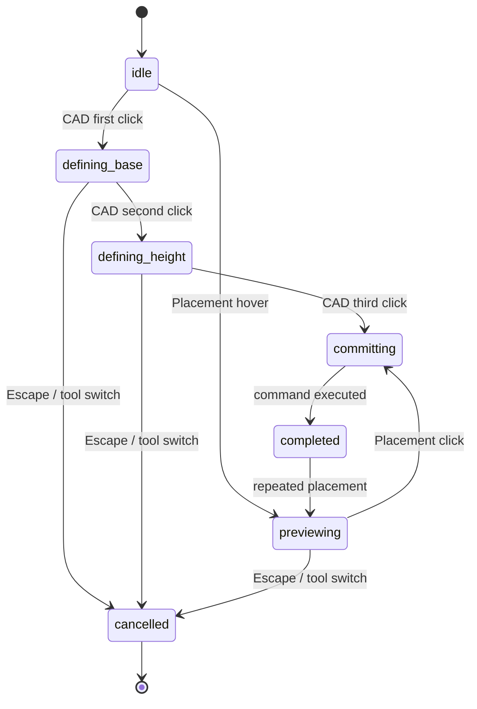

# Primitive creation sessions

The SDK exposes `CadPrimitiveDrawSession` and `PrimitivePlacementSession` for
headless CAD-style creation. They never mutate the document while previewing.
On commit, each session executes the existing `CreatePrimitiveCommand` once,
including the final local transform, so undo and redo remain exact.

```ts
const draw = new CadPrimitiveDrawSession(session, {
  primitive: "cube",
  params: { width: 2, depth: 2, height: 2 },
  workPlane: topPlane,
  snap: { enabled: true, gridSize: 0.25, meshes: existingMeshes },
});

draw.firstClick({ point: start });
draw.updatePointer({ point: baseCorner });
draw.secondClick();
draw.updatePointer({ point: heightPoint });
const created = draw.thirdClick();
```

Placement is reusable: call `updatePointer` for the ghost and `place()` for
each click. Every call to `place()` creates one history command.

```ts
const place = new PrimitivePlacementSession(session, {
  primitive: "cylinder",
  params: { radius: 0.5, height: 2, radialSegments: 24 },
  snap: { enabled: true, surfacePlacement: true, alignToSurface: true },
});
place.updatePointer({ point: cursorPoint });
place.setRotation(rotation);
place.setScale({ x: 1, y: 1, z: 1 });
place.place();
```

## Interaction states



Hosts provide pointer points or rays and a work-plane basis. Orthographic
hosts can use world-Y, world-Z, or world-X as the extrusion axis for top,
front, and right views respectively; custom views provide their own basis.
The preview contains immutable bounds, edges, footprint, dimensions, state,
plane, extrusion axis, snap result, validity, and warning data.
